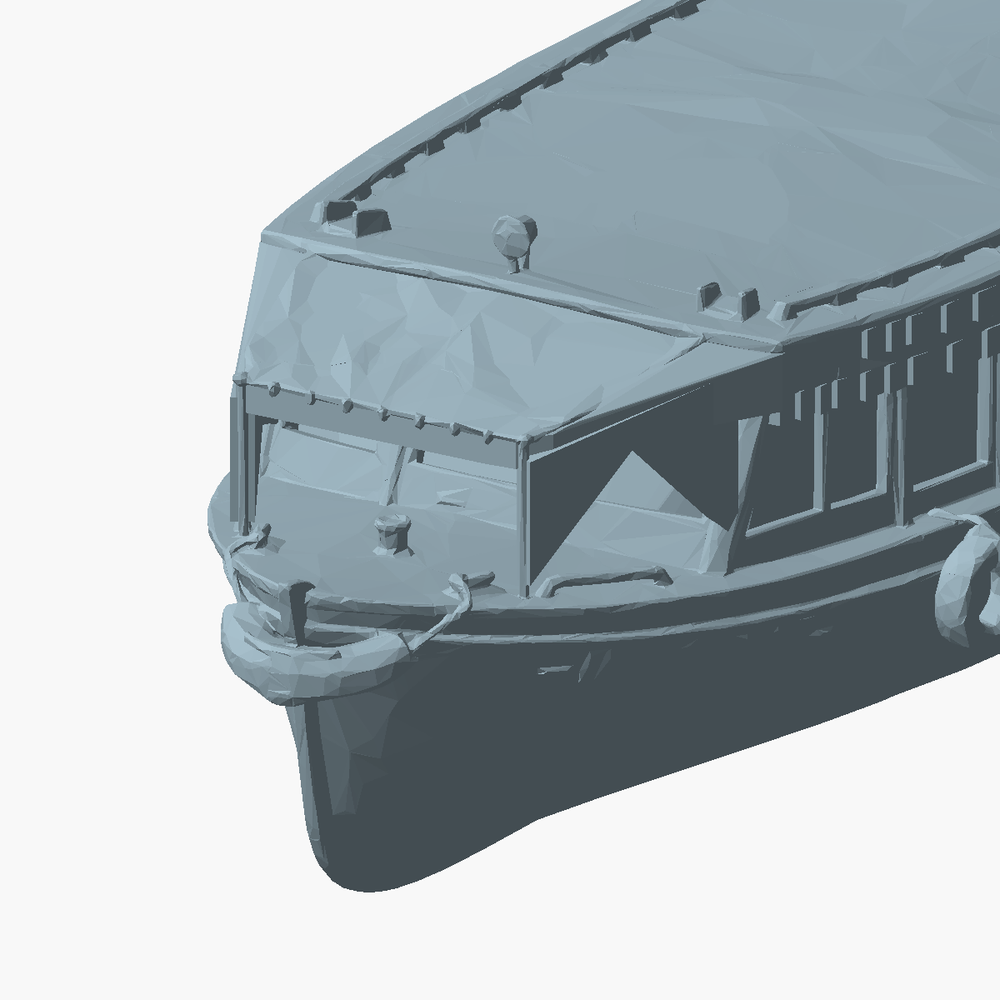

# Toldo con cartelas: variante candidata

STL nuevo: `impresion-3d/modelos/lancha-optimized-print-ready-braced-awning-no-mast-93mm.stl`.
La versión aprobada se conserva intacta.

Se agregan dos cartelas laterales con forma de arco triangular, apoyadas en los
pilares delanteros y el marco trasero. Se regulariza la cara inferior del toldo
para imprimir el centro como un puente transversal. El parabrisas y la proa
abierta permanecen visibles. Las cartelas son visibles de costado; esta variante
prioriza reducir los soportes del toldo y no sustituye automáticamente la anterior.



Reproducción y validación:

```sh
PYTHONDONTWRITEBYTECODE=1 /tmp/delta-stl-venv/bin/python impresion-3d/scripts/brace_boat_awning.py --write --preview
PYTHONDONTWRITEBYTECODE=1 /tmp/delta-stl-venv/bin/python impresion-3d/scripts/brace_boat_awning.py
```

El segundo comando es de solo lectura. Comprueba malla cerrada y orientada,
cuerpo único, límites conservados y contacto de los pies de las cartelas con los
apoyos originales. La unión requiere reparar pequeñas aristas por redondeo STL;
el volumen afectado y su límite están declarados en el JSON. Código 0: PASS;
1: hallazgos; 2: error. Resultado guardado: `braced-awning-validation.json`.

Según ese mismo comando, el puente más largo de las secciones muestreadas mide
18.11 mm y tiene material en ambos extremos. Las secciones se toman antes y
después del nuevo plano inferior; muestran que el material nuevo cruza entre
las cartelas. Los bordes ascendentes de las cartelas avanzan aproximadamente
0.119 mm en horizontal por cada 0.12 mm vertical. Son comprobaciones geométricas,
no una garantía de impresión sin soporte.

La candidata requiere comprobar el puente en el laminador y con PLA en la P1S:
orientación del puente, refrigeración y velocidad influyen. No se obtuvo un
laminado válido ni se imprimió una prueba. El casco puede seguir requiriendo
soportes; esta modificación se limita al toldo delantero.
