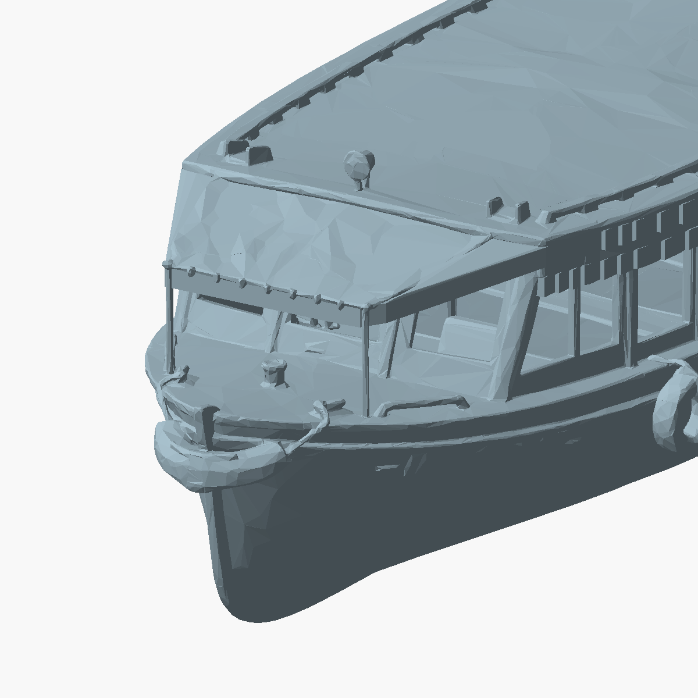
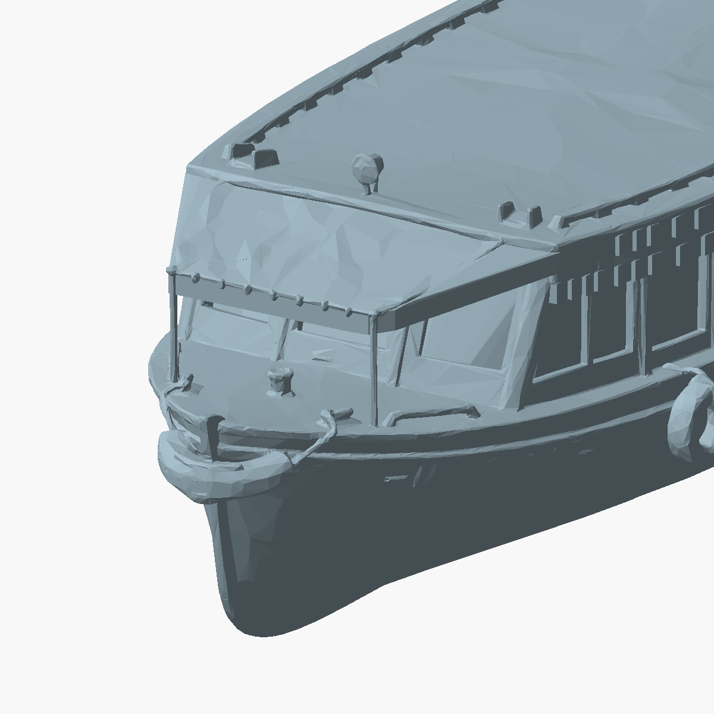
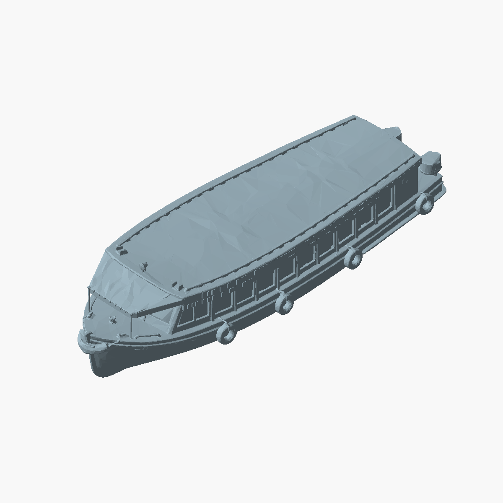
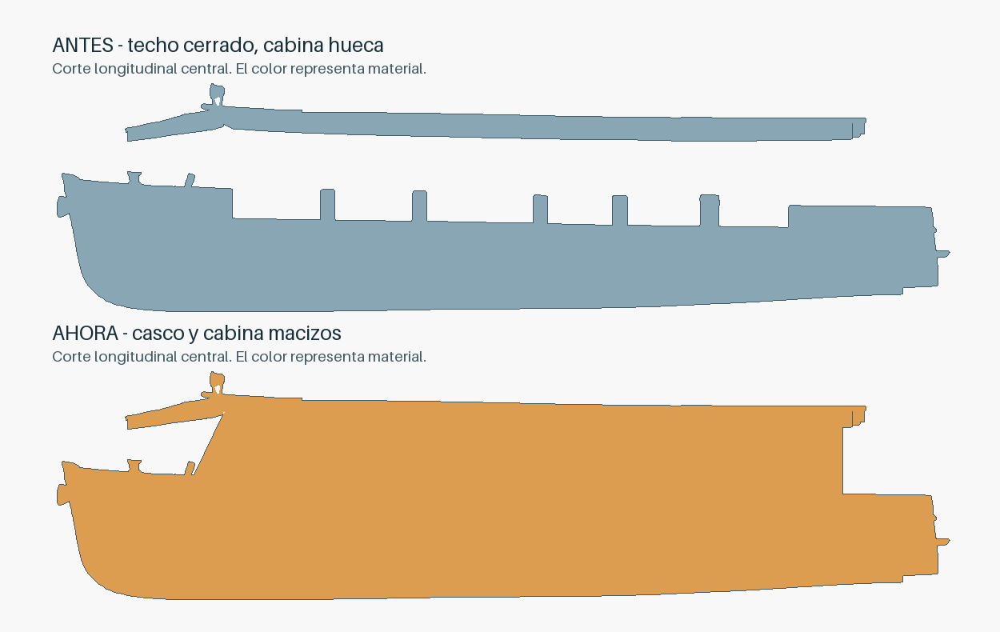

# Variante maciza con ventanas rehundidas

Archivo: `impresion-3d/modelos/lancha-optimized-print-ready-solid-body-recessed-windows-no-mast-93mm.stl`.

La variante anterior prolongaba el contorno exterior del techo y tapaba marcos y
parte del perfil frontal. Esta versión vuelve a la geometría original con techo
cerrado y agrega un núcleo interior retranqueado. Los marcos originales y el
montante inclinado del frente quedan visibles; el respaldo frontal tiene pendiente.
La cubierta delantera protege una proa exterior abierta, no el interior de la
cabina: ese espacio se conserva abierto. El núcleo se limita a la cabina principal
y queda detrás del plano del parabrisas, dejando visibles sus parantes originales.
El cuerpo sigue macizo, con las ventanas como rebajes exteriores. Se conservan
la quilla, defensas y accesorios, así como todos los STL anteriores.

Reproducción y comprobación:

```sh
/tmp/delta-stl-venv/bin/pip install -r impresion-3d/scripts/boat-stl-requirements.txt
PYTHONDONTWRITEBYTECODE=1 /tmp/delta-stl-venv/bin/python impresion-3d/scripts/recess_boat_windows.py --write --preview
PYTHONDONTWRITEBYTECODE=1 /tmp/delta-stl-venv/bin/python impresion-3d/scripts/recess_boat_windows.py
```

La comprobación de solo lectura devuelve PASS y código 0; el informe guardado
está en `impresion-3d/docs/recessed-windows-validation.json`. Comprueba cuerpo cerrado,
normal coherente, núcleo relleno por secciones, límites conservados y ausencia
de pérdida de material del modelo original dentro de la tolerancia numérica.






## Soportes: propuesta pendiente de elección de forma

Equipo confirmado por el usuario: Bambu Lab P1S, PLA. La estimación geométrica
se reproduce sin modificar archivos:

```sh
PYTHONDONTWRITEBYTECODE=1 /tmp/delta-stl-venv/bin/python impresion-3d/scripts/analyze_boat_supports.py
```

El informe de ese comando está en `impresion-3d/docs/support-screening.json`. La zona
dominante es la panza del casco sobre la quilla; no hay cara plana de apoyo en el
modelo actual. Los siguientes resultados proceden del mismo comando. Son área de
caras descendentes que superan un umbral geométrico, no material de soporte del
laminador:

| Alternativa hipotética | Área evaluada que queda, mm² |
|---|---:|
| Modelo corregido de pie | 2454.88 |
| Base plana mediante corte en z=2 mm | 1693.66 |
| Base plana mediante corte en z=3 mm | 1074.59 |
| Base plana mediante corte en z=4 mm | 843.96 |
| Dos mitades longitudinales, suma | 1004.39 |

La base plana requiere sacrificar parte de la quilla y cambia la forma inferior.
Dos mitades apoyadas en el corte conservan las superficies exteriores, pero
requieren unión posterior y pueden necesitar soporte local en rebajes. Una base
integrada que acompañe la panza también cambia el aspecto inferior; no elimina
automáticamente los voladizos de aleros y defensas. No se aplicó ninguna de estas
modificaciones ni se dividió el archivo.

Para una sola pieza, la propuesta concreta es decidir primero si se acepta una
base plana bajo el casco; luego suavizar únicamente aleros inferiores y uniones
de defensas que el laminador siga marcando. Para conservar la quilla, la
alternativa es aceptar dos mitades longitudinales. El umbral de ángulo por sí solo
no garantiza impresión sin soportes: los rebajes cortos de ventanas pueden ser
puentes, y la estabilidad de la pieza depende de su apoyo real.

### Prueba acotada del laminador

El CLI está disponible con `/Applications/BambuStudio.app/Contents/MacOS/BambuStudio --help`.
Se intentó cargar los ajustes del 3MF histórico P1S/PLA y laminar la nueva variante,
sin enviar impresión. El cargador exige presets de máquina/proceso; al adaptar
la envoltura del perfil de proyecto, terminó con `process not compatible with printer`.
No se obtuvieron tiempos, consumo ni soportes laminados válidos. Se necesita un
preset compatible de proceso y filamento para contrastar la propuesta en Bambu Studio.
