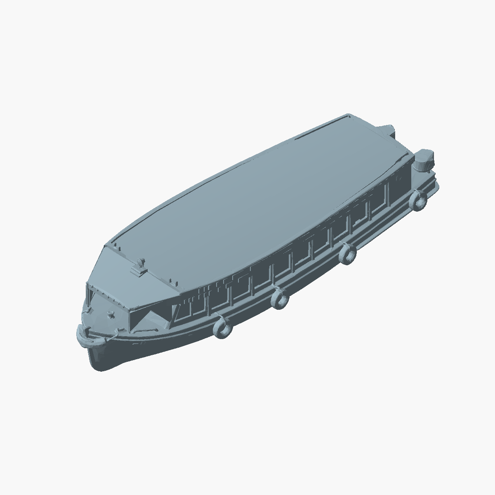

# Techo alisado

Nueva variante: `impresion-3d/modelos/lancha-optimized-print-ready-smooth-roof-braced-awning-no-mast-93mm.stl`.

Se sustituyen las superficies superiores del techo principal y del toldo por
paneles curvos limpios, conservando sus bordes y el accesorio frontal. El cambio
es geométrico: se eliminan las ondulaciones y facetas irregulares de la superficie
original. Se conservan el parabrisas, las ventanas rehundidas, las cartelas y la
cara inferior del toldo. Todas las variantes anteriores permanecen intactas.

```sh
PYTHONDONTWRITEBYTECODE=1 /tmp/delta-stl-venv/bin/python impresion-3d/scripts/smooth_boat_roof.py --write --preview
PYTHONDONTWRITEBYTECODE=1 /tmp/delta-stl-venv/bin/python impresion-3d/scripts/smooth_boat_roof.py
```

El segundo comando es de solo lectura y devuelve PASS, código 0. Verifica malla
cerrada y orientada, cuerpo único, límites conservados y ausencia de cambios en
la región inferior que contiene el puente y las cartelas. El informe guardado
está en `smooth-roof-validation.json`. La pequeña separación de contactos de
triángulos se limita al techo para evitar aristas no manifold al exportar STL;
no se aplica una reparación ni un suavizado global.


