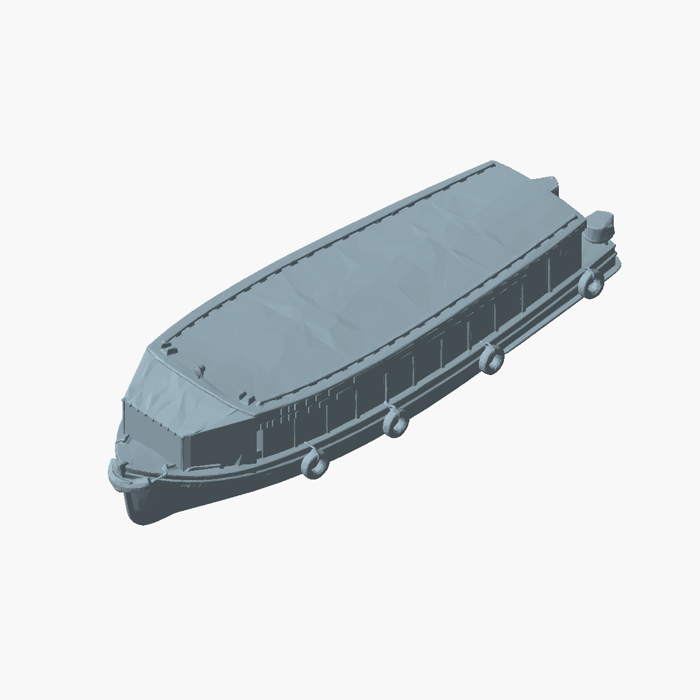
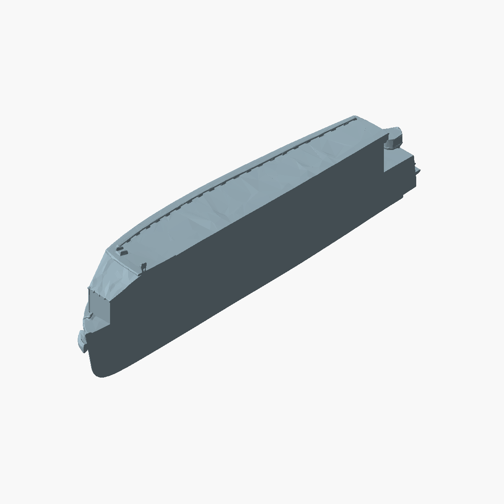
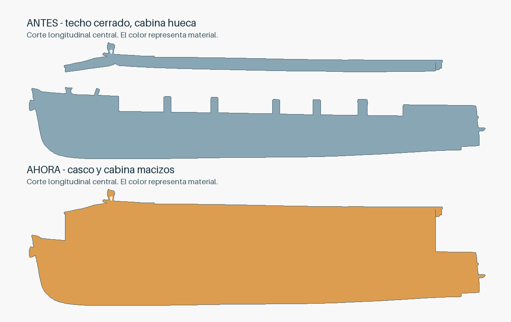

# Lancha con casco y cabina macizos

Entregable: `impresion-3d/modelos/lancha-optimized-print-ready-solid-body-no-mast-93mm.stl`.

Esta variante rellena el volumen interior de la cabina y lo une al casco y al
techo. Las ventanas quedan respaldadas por material sólido. El mástil y las
banderas siguen retirados. Se conservan el STL original y la variante anterior
que rellenaba solamente el techo.

El núcleo se construye a partir de las envolventes de las cubiertas principal y
delantera, prolongadas hasta la banda sólida del casco. Luego se realiza una
unión booleana y se eliminan los cascarones interiores de las cavidades que
quedaron encerradas. Esto conserva la forma del casco, quilla, defensas y cubierta;
no se utiliza una envolvente convexa global de toda la lancha. Se mantienen los
pequeños relieves y rebajes decorativos externos del modelo original.

## Reproducción y evidencia

Desde la raíz del repo:

```sh
python3 -m venv /tmp/delta-stl-venv
/tmp/delta-stl-venv/bin/pip install -r impresion-3d/scripts/boat-stl-requirements.txt
# Si falta la variante previa de techo cerrado:
/tmp/delta-stl-venv/bin/python impresion-3d/scripts/fill_boat_roof.py --write
# Crear la nueva variante y sus vistas:
/tmp/delta-stl-venv/bin/python impresion-3d/scripts/solidify_boat.py --write --preview
# Verificación de solo lectura:
/tmp/delta-stl-venv/bin/python impresion-3d/scripts/solidify_boat.py
```

El último comando devuelve el informe completo y termina con código 0 si pasa,
1 ante hallazgos o 2 ante error. La evidencia guardada está en
`impresion-3d/docs/solid-body-validation.json`: hash de ambas fuentes conservadas,
superficie cerrada y orientada, aristas manifold, cuerpo único, límites exteriores
conservados, volumen y cobertura de secciones interiores del casco y la cabina.
La tolerancia de área de los cortes está indicada en el JSON para absorber el
redondeo numérico de las superficies STL.





La geometría representa un cuerpo macizo. El STL no contiene parámetros del
laminador: una impresión con material en todo ese volumen requiere configurar
el relleno correspondiente al laminar. No se ha realizado una impresión física.
