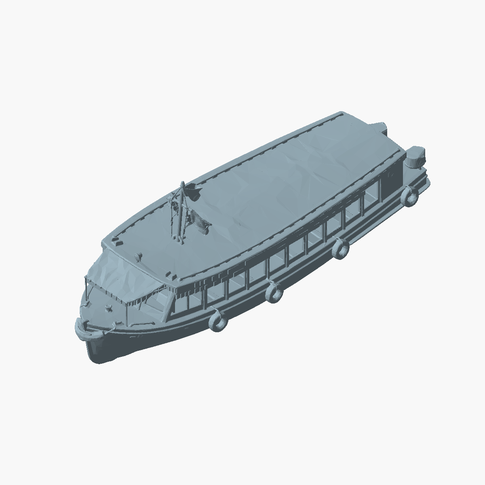
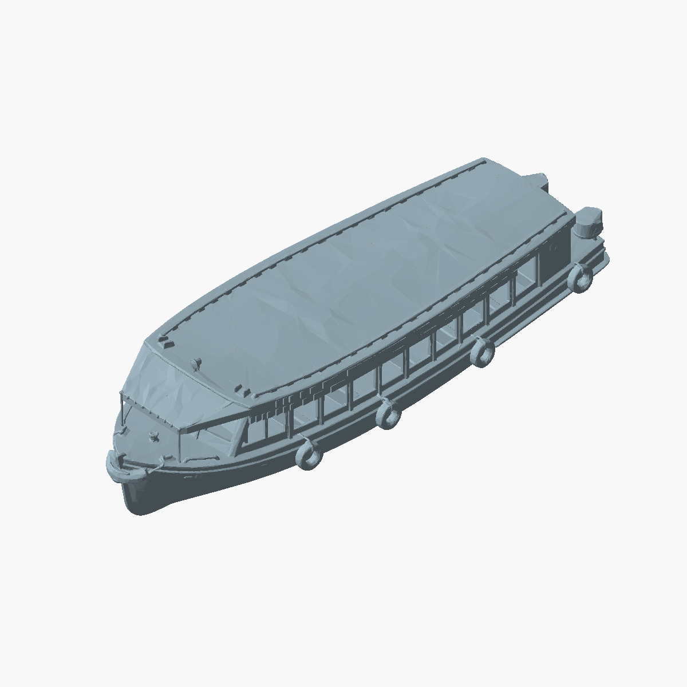

# Lancha con techo cerrado y sin mástil

Archivo nuevo: `impresion-3d/modelos/lancha-optimized-print-ready-solid-roof-no-mast-93mm.stl`.
El STL original, el GLB y los 3MF se conservan sin cambios.

La cubierta principal y la cubierta delantera se rellenan siguiendo la envolvente
convexa de los refuerzos existentes. Se retiran el mástil, las banderas y sus
refuerzos. Se conservan el casco, las ventanas, los accesorios y la escala del
original. El techo mantiene el relieve superficial del modelo original; no se
convierte en una placa horizontal. La cabina permanece hueca.

También se repara la arista no manifold del casco original y se eliminan las
pequeñas cavidades cerradas que quedan dentro del techo al unir los sólidos.
Se conserva una pieza interior desconectada que ya existía en el original.
Los sólidos tienen superficies cerradas; la verificación geométrica no sustituye
una prueba de laminado o de impresión. El STL define la geometría cerrada del
techo; el porcentaje de infill y las capas sólidas son ajustes del laminador.

## Reproducción

Desde la raíz del repo, con Python compatible con las dependencias fijadas
(ejecutado con Python 3.14):

```sh
python3 -m venv /tmp/delta-stl-venv
/tmp/delta-stl-venv/bin/pip install -r impresion-3d/scripts/boat-stl-requirements.txt
/tmp/delta-stl-venv/bin/python impresion-3d/scripts/fill_boat_roof.py --write
```

La validación es de solo lectura por defecto:

```sh
/tmp/delta-stl-venv/bin/python impresion-3d/scripts/fill_boat_roof.py
```

El comando comprueba integridad de la fuente por SHA-256, superficie cerrada,
orientación coherente, aristas manifold, huella del casco conservada, ausencia de
geometría en la región del mástil y cobertura completa del volumen del techo.
La comprobación de cobertura admite únicamente la tolerancia de volumen indicada
en el JSON para el redondeo de superficies STL float32. Termina con código 0 si
pasa, 1 si hay hallazgos y 2 ante errores. El resultado guardado de ese mismo
comando está en `impresion-3d/docs/solid-roof-validation.json`.

Vistas reproducibles con sombreado y buffer de profundidad:

```sh
/tmp/delta-stl-venv/bin/python impresion-3d/scripts/render_boat_stl.py impresion-3d/modelos/lancha-optimized-print-ready-reinforced-93mm.stl impresion-3d/docs/lancha-before.png
/tmp/delta-stl-venv/bin/python impresion-3d/scripts/render_boat_stl.py impresion-3d/modelos/lancha-optimized-print-ready-solid-roof-no-mast-93mm.stl impresion-3d/docs/lancha-solid-roof-no-mast.png
```



